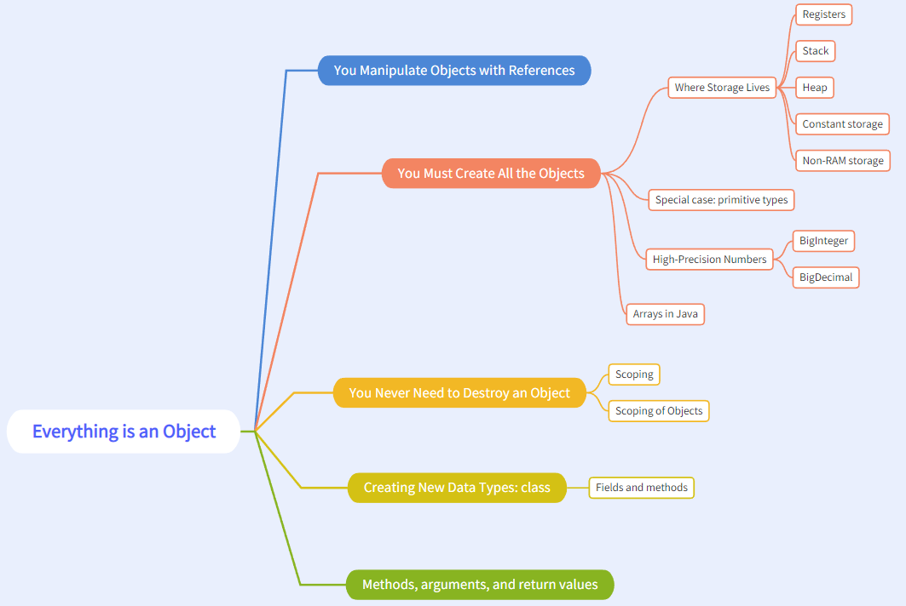
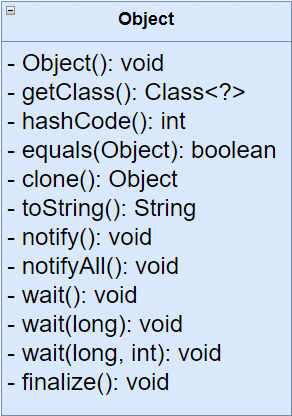

# (Almost) Everything in java is an object
Class `Object` is the root of the class hierarchy.

## Why Almost
- primitives

java still have primitives which is not oop.

## How to manipulate object
in c/c++ you manipulate element with pointer.
you use `reference` to manupulate objects.
```java
String a;
```

## How to create object
you use `new` to create object in heap.
```java
String a = new String("a");
```

## Object


    every class is directry or indirectry derived from the `Object` class.
    So, in java everty object have the same method inheriated from `Object`.

## Class
    class (type) create our user-defined class.
    In java, `Class` contains too many information.
    for example, you have an `Object` but how can you know 
    what kind of `Class(type)` it is ? you use `Class`.

## Object and Class
`class` is the blueprint of `object`
`object` is instance of `class`

### Chicken-Egg problem
`java.lang.Class` extends `java.lang.Object`
    
    when jvm bootstrap, it mix up all the things.


## Code Reusing

### Composition (has-a)
    your object have other objects as fields.
    you can also change the member objects at runtime.

### Inheritance (is-a)
    you inheritant from existing object.
    Inheritance is happening in compile-time, so you cannot 
    change at runtime.

#### Is-Like-a
    you add new interface to derived type, thus extending the 
    interface. This can be described as an `is-like-a` relationship.