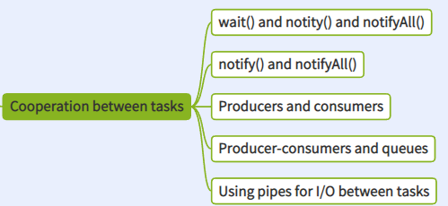

# Cooperation
thread can cooperate to finish tasks.
use the bad to do the good ?

mutex is to prevent from wrong and now it is for cooperation.

## wait()
```java
public class T {
    public static synchronized void main(String[] args) throws InterruptedException {
        System.out.println("==========");
        new T().wait();
        System.out.println("000000000000000000");
    }
}

Exception in thread "main" java.lang.IllegalMonitorStateException: current thread is not owner

---
public class T {
    synchronized void w(T t) throws InterruptedException {
        t.wait();
    }
    public static void main(String[] args) throws InterruptedException {
        System.out.println("==========");
        // new T().wait();    [1]
        T t = new T();     
        t.w(t);            // [2]
        System.out.println("000000000000000000");
    }
}
```
```java
public class T {

    public synchronized void a() throws InterruptedException {
        System.out.println(" >>> before wait ");
        wait();
        System.out.println(" >> after wait");
    }
    public synchronized void b() {
        System.out.println(">>> notify");
        notify();
    }
    public static void main(String[] args) throws InterruptedException {
        T t = new T();
        // [1] start a new thread a notify
        new Thread(() -> {
            try {
                TimeUnit.SECONDS.sleep(2);
            } catch (InterruptedException e) {
                // TODO Auto-generated catch block
                e.printStackTrace();
            }
            t.b();
        }).start();
        t.a();
    }
    public static void main(String[] args) throws InterruptedException {
        T t = new T();        
        t.a();
        // [2] just call notify directly -> program never progress
        t.b();
    }
}
```

## notify() notifyAll()
in fact, only the tasks that are waiting on a particular lock are awoken 
when notifyAll( ) is called/or that lock