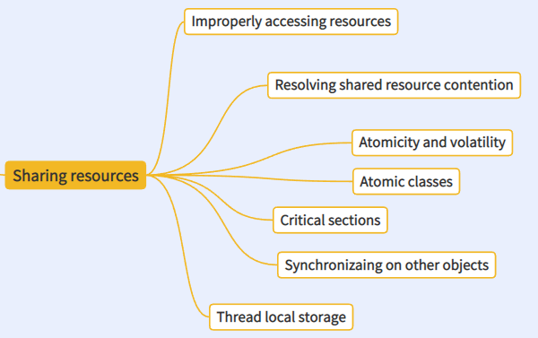

# Share Resources
it is always ok if you are alone.
people comes, contention comes.
people do not share, we contend.

What if multiple threads need one thing ?

```java
public class T {

    static int a = 0;
    static void next() {
        a++;        
    }
    public static void main(String[] args) throws InterruptedException, ExecutionException {
        IntStream.range(0, 10).forEach((i) -> {
            new Thread(() -> {                
                T.next();
                System.out.println(">>>>>>>>> a: " + T.a);
            }).start();
        });
    }
}
>>>>>>>>> a: 2
>>>>>>>>> a: 6
>>>>>>>>> a: 5
>>>>>>>>> a: 4
>>>>>>>>> a: 10
>>>>>>>>> a: 3
>>>>>>>>> a: 3
>>>>>>>>> a: 9
>>>>>>>>> a: 8
>>>>>>>>> a: 7
```
the output is duplicated, which is not what you want.

## Mutex (mutual exclusion)
serialize access to shared resources

## atomic operation
Atomicity applies to "simple operations" on primitive types 
except for longs and doubles

## Visibility

## Compare And Set

## Critical sections


## ThreadLocal