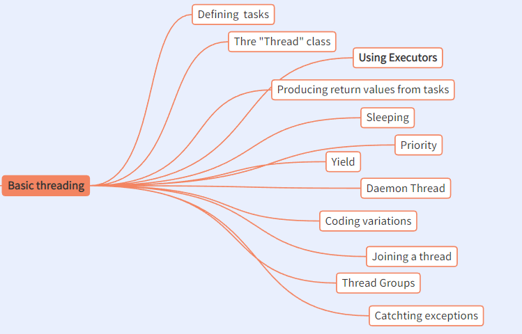

# Thread
A thread is a basic unit of CPU utilization.
it comprises a thread ID, a program counter (PC) and a stack.

## Process Vs. Thread
### Process
Process is a program in execution
process have all the resources to run.
### Thread
Process can have many threads, and thread share 
the resources of process.


## Creating Task
```java
public class T implements Runnable {
    @Override
    public void run() {
        int i = 0;
        while (i < 5) {
            try {
                Thread.sleep(1000);
            } catch (Exception e) {}
            System.out.println(">>> thread: " + Thread.currentThread().getName());
            i++;
        }
    }
    public static void m0() {
        new Thread(new T()).start();
        new T().run();
    }
    public static void m1() {
        new T().run();
        new Thread(new T()).start();
    }
    public static void main(String[] args) {
        m0();
        m1();
    }
}
```
what m0() will output ?
``` java
>>> thread: main
>>> thread: Thread-0
>>> thread: main
>>> thread: Thread-0
>>> thread: main
>>> thread: Thread-0
>>> thread: main
>>> thread: Thread-0
>>> thread: main
>>> thread: Thread-0
```
what m1() will output ?
``` java
>>> thread: main
>>> thread: main
>>> thread: main
>>> thread: main
>>> thread: main
>>> thread: Thread-0
>>> thread: Thread-0
>>> thread: Thread-0
>>> thread: Thread-0
>>> thread: Thread-0 
```
we create task with `Runnable` interface, but if you use it as normal
class there is no magic.
you need a `Thread` to execute your task.

```java
public class T extends Thread {
    @Override
    public void run() {
        System.out.println(">>>>>>>>>>>");
    }
    public static void main(String[] args) {
        new T().start();
    }
}
```

Under the hood, we can only create thread with `Thread` class.
We create our task then attach the task to the `Thread`.
So, there is only one way to create `Thread`.

## Callable Task
How can you get the result of your task.
Thread do not care the result of your task.
```java
public class T implements Callable<String> {
    @Override
    public String call() throws Exception {
        return "sssssssssssss";
    }
    public static void main(String[] args) throws Exception {
        ExecutorService es = Executors.newCachedThreadPool();
        Future<String> r = es.submit(new T());
        es.shutdown();
        System.out.println(r.get());
    }
}
```

## Sleeping
You can make thread waiting, but how ?

`Thread.sleep(x)` && `TimeUnit.SECONDS.sleep(x)`
```java
public class T {
    public static void main(String[] args) throws InterruptedException{
        Thread.sleep(1000);
        TimeUnit.SECONDS.sleep(2);
    }
}
```
`TimeUnit.SECONDS.sleep(x)` is a wrapper of `Thread.sleep(x)`
and when `Thread` is sleeping you can interrupte it and 
the thread will throw `InterrptedException`.

## Daemon
What is Daemon Thread ?
Daemon thread is background thread.
Java main program will not wait daemon thread to finish so main program
will terminate all daemon threads when main program exit.
However java main program will wait non-daemon thread to finish thier
tasks so main program will not exit before non-daemon thread finish 
their tasks.
```java
public class T {
    public static void main(String[] args) throws InterruptedException{
        Thread t = new Thread(() -> {
            try {
                TimeUnit.SECONDS.sleep(3);
            } catch (InterruptedException e) {
                // TODO Auto-generated catch block
                e.printStackTrace();
            }
        });
        t.setDaemon(true); // [1] main program will behave differently
        t.start();
    }
}
```
ThreadFactory
```java
public class B implements ThreadFactory {
    @Override
    public Thread newThread(Runnable r) {
        Thread t = new Thread(r);
        t.setDaemon(true);
        return t;
    }
    public static void main(String[] args) {
        ThreadPoolExecutor tpe = new ThreadPoolExecutor(
            1, 10, 1, TimeUnit.SECONDS, 
            new SynchronousQueue<>(), new B()
        );
    }
}
```

## Join
Join is like joining together and
wait for the other to finish.
```java
public class T {
    public static void main(String[] args) {
        Thread t0 = new Thread(() -> {
            try {
                TimeUnit.SECONDS.sleep(2);
            } catch (InterruptedException e) {
                // TODO Auto-generated catch block
                e.printStackTrace();
            }
        });
        Thread t1 = new Thread(() -> {
            try {
                System.out.println(">>>>>>>>>");
                t0.join();
                System.out.println("<<<<<<<");
            } catch (InterruptedException e) {
                // TODO Auto-generated catch block
                e.printStackTrace();
            }
        });
        t1.start();
        t0.start();
    }
} 
```

## Exception
We cannot catch the exception in new Thread.
```java
public class T {
    public static void main(String[] args) {
        Thread t = new Thread(() -> {
            throw new RuntimeException("exception in thread");
        });
        try {
            t.start();
        } catch (Exception e) {
            System.out.println("==========");
            e.printStackTrace();
        }
    }
}
```
the try-catch in main method can not catch the exception we anticipated.
we can't catch the exception throwed from a thread.

`Thread.UncaughtExceptionHandler`
```java
public class T {
    static class MyUncaughtExceptionHandler implements Thread.UncaughtExceptionHandler {
        @Override
        public void uncaughtException(Thread t, Throwable e) {
            System.out.println(" caught " + e);
        }
    }
    public static void main(String[] args) {
        Thread t = new Thread(() -> {
            throw new RuntimeException("exception in thread");
        });
        t.setUncaughtExceptionHandler(new MyUncaughtExceptionHandler());        
        t.start();
    }
}
```
With `Thread.UncaughtExceptionHandler` you can deal with `Exception` 
in `uncaughtException` method.

## Fork/Join first touch
```java
public class T {
    public static void main(String[] args) {
        CompletableFuture cf = CompletableFuture.runAsync(() -> {
            System.out.println(" run async ");
            System.out.println(" thread: " + Thread.currentThread().getName());            
        });
        cf.join(); // [1] main thread will not wait from cf to finish
    }
    public static void main(String[] args) throws InterruptedException, ExecutionException {
        CompletableFuture cf = CompletableFuture.runAsync(() -> {
            System.out.println(" run async ");
            System.out.println(" thread: " + Thread.currentThread().getName());            
        });
        CompletableFuture<String> r = CompletableFuture.supplyAsync(() -> "A");

        System.out.println("========");
        System.out.println(r.get());
    }
}
output:
    run async 
    thread: ForkJoinPool.commonPool-worker-1
```
Here comes a new Pool (ForkJoinPool)